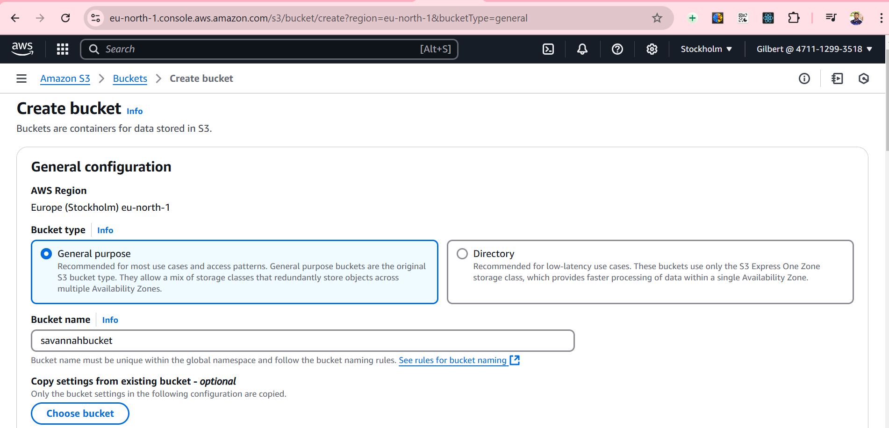
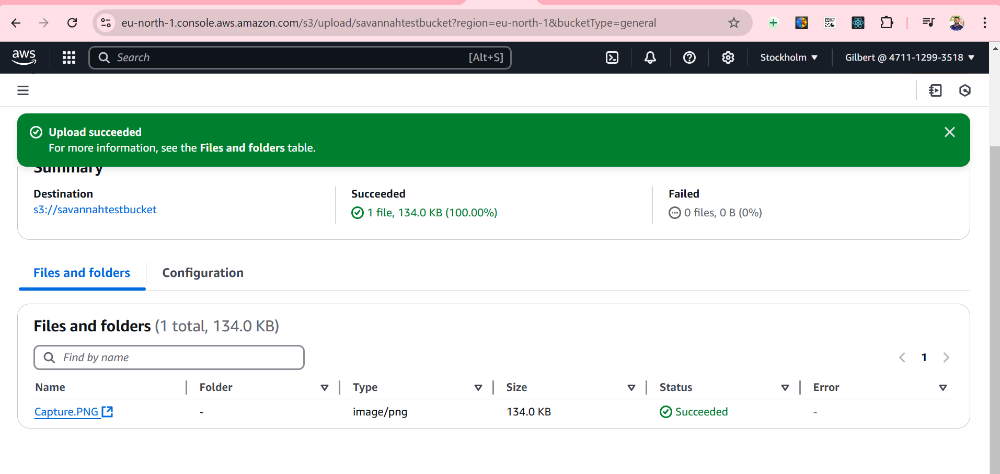
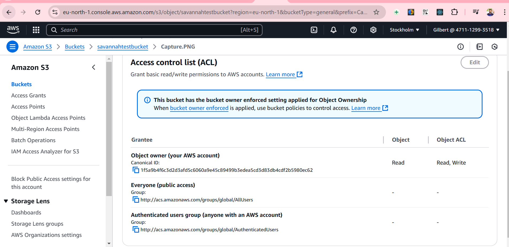
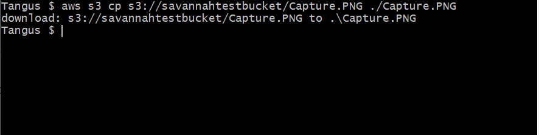

# Task 4: Cloud Storage and Networking (AWS S3)

## Objective
The goal of this task was to:
1. Create and configure cloud storage using **AWS S3**.
2. Perform the following actions:
   - Upload a file to the storage.
   - Set appropriate access permissions.
   - Retrieve the file using AWS CLI.

---

## Step 1: Create an AWS S3 Bucket

### Action
1. Navigate to the **AWS Management Console**.
2. Open the **S3 service**.
3. Click on **Create Bucket**.
4. Provide a unique bucket name (e.g., `my-s3-bucket-12345`).
5. Select the desired region (e.g., `us-east-1`).
6. Leave the default settings or enable versioning as needed.
7. Click **Create** to finalize the bucket creation.

### Challenges Faced
1. **Challenge**: Ensuring a globally unique bucket name.
   - **Resolution**: Appended a random alphanumeric string to the bucket name to ensure uniqueness.
2. **Challenge**: Initial confusion with selecting bucket configuration settings.
   - **Resolution**: Consulted AWS documentation to understand default options versus custom configurations.

### Screenshot


---

## Step 2: Upload a File to the S3 Bucket

### Action
1. Select the newly created bucket in the **S3 Console**.
2. Click **Upload**.
3. Select a file from the local machine (e.g., `sample.txt`).
4. Review the settings (e.g., storage class as `Standard`).
5. Click **Upload** to complete the process.

### Challenges Faced
1. **Challenge**: Selecting the correct storage class for the file.
   - **Resolution**: Chose the `Standard` storage class for simplicity and later explored other classes for cost optimization.
2. **Challenge**: Uploading a file while navigating an unfamiliar AWS S3 interface.
   - **Resolution**: Reviewed AWS documentation and user guides to familiarize myself with the interface.

### Screenshot


---

## Step 3: Set Appropriate Access Permissions

### Action
1. Go to the **Permissions** tab of the uploaded file.
2. Review and set **Access Control List (ACL)**:
   - Enabled **Public Read Access** for testing purposes.
   - Left other permissions as default.
3. Save changes.

### Challenges Faced
1. **Challenge**: Balancing testing needs with data security best practices.
   - **Resolution**: Temporarily enabled public read access for testing and reverted to private settings afterward.
2. **Challenge**: Understanding bucket policy versus object-level permissions.
   - **Resolution**: Experimented with both approaches and referred to AWS policy examples.

### Screenshot


---

## Step 4: Retrieve the File Using AWS CLI

### Action
1. Ensure **AWS CLI** is installed and configured with valid credentials.
   - Run `aws configure` to set up the **Access Key**, **Secret Key**, **Region**, and **Output Format**.
2. Run the following command to download the file:
   ```bash
   aws s3 cp s3://<your-bucket-name>/<file-name> .
### Screenshot


---